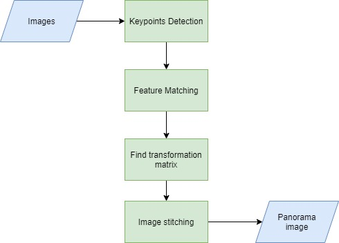

# Image-stitching

Image stitching is one of the essential tasks of image processing and editing. The concept of image stitching is capturing a big scene from a set of images that share some common region or features. I am showing how to perform image stitching using Python and openCV.
The code is able to stitch images together, even if they are in different scales, or taken from different angles.

### 1. Keypoints Detection
The code allows you to choose a different feature-detector-descriptor method according to your application and desired results.
By running the function featureDetector() on the both images, we will get the key points and descriptor for the two images. 

### 2. Feature Matching
Feature Matching finds the matched points between two images. The matched points are the overlapping area or features between the two images. The code allows you to choose the feature matcher type to optimise results.

### 3. Find transformation matrix
perspective_transformation() function finds the transformation matrix that will stitch two images together based on matching points.
 
 ### 4. Image stitching
 The final function stitch_images() calls all the previous functions and produce a panorama image of the given images.

